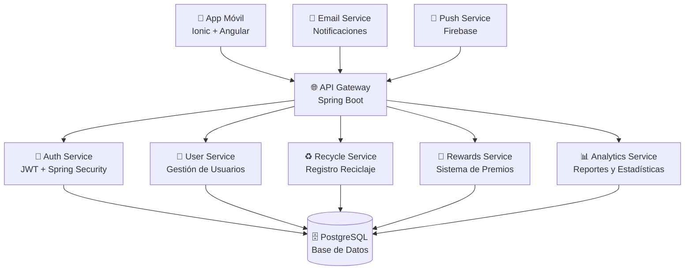

# 🌱 Eco Friendly Code - Sistema de Gestión Ambiental Universitario

> **Plataforma completa de gamificación ambiental para instituciones educativas**

[](https://angular.io/)
[](https://ionicframework.com/)
[](https://www.typescriptlang.org/)
[](https://capacitorjs.com/)
[](https://nodejs.org/)
[](LICENSE)

## 📋 Tabla de Contenidos

- [🎯 Visión General](#-visión-general)
- [✨ Características Principales](#-características-principales)
- [🏗️ Arquitectura del Sistema](#️-arquitectura-del-sistema)
- [🛠️ Stack Tecnológico](#️-stack-tecnológico)
- [📁 Estructura del Proyecto](#-estructura-del-proyecto)
- [🚀 Instalación y Configuración](#-instalación-y-configuración)
- [🔧 Configuración del Entorno](#-configuración-del-entorno)
- [📚 APIs y Endpoints Completos](#-apis-y-endpoints-completos)
- [🗄️ Modelos de Datos](#️-modelos-de-datos)
- [🔄 Servicios Frontend](#-servicios-frontend)
- [🎨 Desarrollo Frontend](#-desarrollo-frontend)
- [🧪 Testing y Calidad](#-testing-y-calidad)
- [🚀 Despliegue y Producción](#-despliegue-y-producción)
- [🤝 Contribución](#-contribución)
- [📄 Licencia](#-licencia)

---

## 🎯 Visión General

**Eco Friendly Code** es una aplicación móvil híbrida (iOS/Android/Web) desarrollada con Ionic + Angular que implementa un sistema completo de gamificación ambiental para estudiantes universitarios. La plataforma permite registrar actividades de reciclaje, acumular puntos, canjear recompensas ecológicas y visualizar el impacto ambiental institucional.

### 🎯 Objetivos Estratégicos

- **Gamificación Ambiental**: Convertir actividades ecológicas en experiencias engaging mediante puntos, niveles y recompensas
- **Monitoreo Institucional**: Seguimiento cuantitativo del impacto ambiental de toda la institución
- **Educación Continua**: Fomentar hábitos sostenibles a través de feedback inmediato y educación
- **Comunidad Verde**: Crear una red de estudiantes comprometidos con la sostenibilidad

### 👥 Roles de Usuario

| Rol | Permisos | Funcionalidades |
|-----|----------|-----------------|
| **Estudiante** | Básicos | Registro reciclaje, ver perfil, canjear premios, dashboard |
| **Profesor** | Moderación | Aprobar reciclajes, ver reportes, gestionar estudiantes |
| **Administrador** | Completos | Configuración sistema, gestión usuarios, reportes avanzados |

---

## ✨ Características Principales

### 🎮 Sistema de Gamificación
- **Puntos por Reciclaje**: Sistema automático de cálculo basado en material y peso
- **Niveles de Usuario**: Progresión basada en puntos acumulados
- **Recompensas Ecológicas**: Catálogo de premios sostenibles (árboles, productos eco)
- **Rankings**: Competencia saludable entre estudiantes e instituciones

### 📊 Dashboard Interactivo
- **Métricas en Tiempo Real**: Estadísticas personales e institucionales
- **Gráficos de Impacto**: Visualización de CO2 evitado, materiales reciclados
- **Actividad Reciente**: Historial de reciclajes con estados (aprobado/pendiente)
- **Comparativas**: Posición relativa en rankings institucionales

### ♻️ Gestión de Reciclaje
- **Registro Fotográfico**: Captura de evidencias de reciclaje
- **Validación por IA**: Detección automática de materiales (futuro)
- **Cálculo Automático**: Puntos basados en tipo de material y peso
- **Workflow de Aprobación**: Sistema de validación por coordinadores

### 👤 Gestión de Perfiles
- **Información Académica**: Carrera, semestre, institución
- **Historial Completo**: Todos los reciclajes y canjes realizados
- **Estadísticas Personales**: Impacto ambiental individual
- **Configuración Personalizada**: Notificaciones, tema, idioma

### 🔔 Sistema de Notificaciones
- **Push Notifications**: Alertas nativas en móvil
- **Recordatorios**: Prompts para registrar reciclaje
- **Anuncios**: Nuevas recompensas y eventos ambientales
- **Reportes Semanales**: Resumen de actividad semanal

---

## 🏗️ Arquitectura del Sistema

### Arquitectura General



### Arquitectura Frontend (Ionic/Angular)

```
src/
├── app/
│   ├── core/                      # Núcleo de la aplicación
│   │   ├── models/                # Interfaces TypeScript
│   │   │   ├── auth.model.ts      # Modelos de autenticación
│   │   │   ├── user.model.ts      # Modelos de usuario
│   │   │   ├── recycle.model.ts   # Modelos de reciclaje
│   │   │   ├── rewards.model.ts   # Modelos de recompensas
│   │   │   └── dashboard.model.ts # Modelos de dashboard
│   │   ├── services/              # Servicios HTTP
│   │   │   ├── auth.service.ts    # Autenticación
│   │   │   ├── user.service.ts    # Gestión usuario
│   │   │   ├── recycle.service.ts # Reciclaje
│   │   │   ├── rewards.service.ts # Premios
│   │   │   ├── dashboard.service.ts # Dashboard
│   │   │   ├── history.service.ts # Historial
│   │   │   └── notification.service.ts # Notificaciones
│   │   ├── guards/                # Guards de rutas
│   │   │   └── auth.guard.ts      # Protección rutas
│   │   └── interceptors/          # Interceptores HTTP
│   │       └── auth.interceptor.ts # JWT automático
│   ├── features/                  # Módulos por característica
│   │   ├── auth/                  # Autenticación
│   │   │   ├── login/             # Página login
│   │   │   └── register/          # Página registro
│   │   └── user-student-views/    # Vistas estudiante
│   │       ├── dashboard/         # Dashboard principal
│   │       ├── mi-perfil/         # Perfil usuario
│   │       ├── premios/           # Catálogo premios
│   │       ├── registrar-reciclaje/ # Registro reciclaje
│   │       ├── mi-historial/      # Historial actividades
│   │       └── configuracion/     # Configuración app
│   ├── shared/                    # Componentes compartidos
│   │   ├── components/            # Componentes reutilizables
│   │   ├── pipes/                 # Pipes personalizados
│   │   │   ├── number-format.pipe.ts
│   │   │   └── time-ago.pipe.ts
│   │   └── directives/            # Directivas
│   └── home/                      # Landing page
├── assets/                        # Recursos estáticos
│   ├── icons/                     # Iconos aplicación
│   └── images/                    # Imágenes materiales
├── environments/                  # Configuración por entorno
│   ├── environment.ts             # Desarrollo
│   └── environment.prod.ts        # Producción
└── theme/                         # Tema global
    └── variables.scss             # Variables SCSS
```

---

## 🛠️ Stack Tecnológico

### Frontend
| Tecnología | Versión | Propósito |
|------------|---------|-----------|
| **Angular** | 20.0.0 | Framework principal SPA |
| **Ionic** | 8.0.0 | UI Framework móvil |
| **TypeScript** | 5.4 | Lenguaje de programación |
| **Capacitor** | 8.3.1 | Runtime nativo móvil |
| **RxJS** | 7.8.0 | Programación reactiva |
| **SCSS** | Built-in | Estilos avanzados |

### Backend (Implementación Requerida)
| Tecnología | Versión | Propósito |
|------------|---------|-----------|
| **Spring Boot** | 3.2.x | Framework backend |
| **Java** | 21 LTS | Lenguaje JVM |
| **PostgreSQL** | 15.x | Base de datos |
| **JWT** | 0.11.x | Autenticación |
| **Spring Security** | 6.x | Seguridad |
| **JPA/Hibernate** | 6.x | ORM |
| **Flyway** | 9.x | Migraciones DB |

### DevOps & Herramientas
| Categoría | Herramientas |
|-----------|-------------|
| **Control de Versiones** | Git, GitHub |
| **CI/CD** | GitHub Actions |
| **Contenedorización** | Docker, Docker Compose |
| **Despliegue** | Vercel (Frontend), Railway (Backend) |
| **Testing** | Jasmine, Karma, JUnit |
| **Linting** | ESLint, Prettier |
| **Documentación** | Swagger/OpenAPI |

---

## 📁 Estructura del Proyecto

```
eco-friendly-code/
├── 📂 src/
│   ├── 📂 app/
│   │   ├── 📂 core/
│   │   │   ├── 📂 models/
│   │   │   │   ├── configuration.model.ts
│   │   │   │   ├── dashboard.model.ts
│   │   │   │   ├── history.model.ts
│   │   │   │   ├── recycle.model.ts
│   │   │   │   ├── rewards.model.ts
│   │   │   │   └── user.model.ts
│   │   │   └── 📂 services/
│   │   │       ├── auth.service.ts
│   │   │       ├── configuration.service.ts
│   │   │       ├── dashboard.service.ts
│   │   │       ├── history.service.ts
│   │   │       ├── notification.ts
│   │   │       ├── recycle.service.ts
│   │   │       ├── rewards.service.ts
│   │   │       └── user.service.ts
│   │   ├── 📂 features/
│   │   │   ├── 📂 Auth/
│   │   │   │   ├── 📂 login/
│   │   │   │   │   ├── login-routing.module.ts
│   │   │   │   │   ├── login.module.ts
│   │   │   │   │   ├── login.page.html
│   │   │   │   │   ├── login.page.scss
│   │   │   │   │   ├── login.page.spec.ts
│   │   │   │   │   └── login.page.ts
│   │   │   │   └── 📂 register/
│   │   │   │       ├── register-routing.module.ts
│   │   │   │       ├── register.module.ts
│   │   │   │       ├── register.page.html
│   │   │   │       ├── register.page.scss
│   │   │   │       ├── register.page.spec.ts
│   │   │   │       └── register.page.ts
│   │   │   └── 📂 UserStudentViews/
│   │   │       ├── 📂 configuracion/
│   │   │       ├── 📂 dashboard/
│   │   │       ├── 📂 mi-historial/
│   │   │       ├── 📂 mi-perfil/
│   │   │       ├── 📂 premios/
│   │   │       ├── 📂 registrar-reciclaje/
│   │   │       └── 📂 user-student-tabs/
│   │   ├── 📂 shared/
│   │   │   └── 📂 pipes/
│   │   │       ├── number-format.pipe.ts
│   │   │       └── time-ago.pipe.ts
│   │   └── 📂 home/
│   ├── 📂 assets/
│   │   ├── 📂 icon/
│   │   └── 📂 images/
│   ├── 📂 environments/
│   │   ├── environment.prod.ts
│   │   └── environment.ts
│   ├── 📂 theme/
│   │   └── variables.scss
│   ├── index.html
│   ├── main.ts
│   ├── polyfills.ts
│   ├── test.ts
│   └── zone-flags.ts
├── 📂 www/                          # Build output
├── angular.json                     # Config Angular CLI
├── capacitor.config.ts              # Config Capacitor
├── ionic.config.json                # Config Ionic
├── karma.conf.js                    # Config testing
├── package.json                     # Dependencias
├── tsconfig.json                    # Config TypeScript
├── tsconfig.app.json
├── tsconfig.spec.json
└── README.md                        # Este archivo
```

---

## 🚀 Instalación y Configuración

### Prerrequisitos

- **Node.js**: 18.x o superior
- **npm**: 9.x o superior (viene con Node.js)
- **Git**: Para control de versiones
- **Android Studio**: Para desarrollo Android (opcional)
- **Xcode**: Para desarrollo iOS (opcional, solo macOS)

### 1. Clonar el Repositorio

```bash
git clone https://github.com/tu-usuario/eco-friendly-code.git
cd eco-friendly-code
```

### 2. Instalar Dependencias

```bash
npm install
```

### 3. Configurar Variables de Entorno

Crear archivo `src/environments/environment.ts`:

```typescript
export const environment = {
  production: false,
  apiUrl: 'http://localhost:8080/api/v1',
  appName: 'Eco Friendly Code',
  version: '1.0.0'
};
```

### 4. Ejecutar en Desarrollo

```bash
# Servidor de desarrollo
npm start

# O usando Angular CLI
ng serve
```

La aplicación estará disponible en `http://localhost:4200`

### 5. Configurar Capacitor (Móvil)

```bash
# Agregar plataformas
npx cap add android
npx cap add ios

# Sincronizar cambios
npx cap sync

# Abrir en Android Studio
npx cap open android

# Abrir en Xcode
npx cap open ios
```

---

## 🔧 Configuración del Entorno

### Variables de Entorno

#### `src/environments/environment.ts` (Desarrollo)
```typescript
export const environment = {
  production: false,
  apiUrl: 'http://localhost:8080/api/v1',
  appName: 'Eco Friendly Code Dev',
  version: '1.0.0-dev',
  enableDebug: true,
  logLevel: 'debug'
};
```

#### `src/environments/environment.prod.ts` (Producción)
```typescript
export const environment = {
  production: true,
  apiUrl: 'https://api.ecofriendlycode.com/api/v1',
  appName: 'Eco Friendly Code',
  version: '1.0.0',
  enableDebug: false,
  logLevel: 'error'
};
```

### Configuración de Capacitor

#### `capacitor.config.ts`
```typescript
import { CapacitorConfig } from '@capacitor/cli';

const config: CapacitorConfig = {
  appId: 'com.ecofriendlycode.app',
  appName: 'Eco Friendly Code',
  webDir: 'www',
  server: {
    androidScheme: 'https'
  },
  plugins: {
    SplashScreen: {
      launchShowDuration: 3000,
      launchAutoHide: true
    }
  }
};

export default config;
```

### Configuración de Ionic

#### `ionic.config.json`
```json
{
  "name": "eco-friendly-code",
  "integrations": {
    "capacitor": {}
  },
  "type": "angular-standalone",
  "id": "com.ecofriendlycode.app"
}
```

---

## 📚 APIs y Endpoints Completos

La aplicación consume una API RESTful implementada en Spring Boot. Todos los endpoints requieren autenticación JWT excepto login y registro.

### 🔐 Autenticación (Auth Service)

#### `POST /api/v1/auth/login`
**Autenticar usuario**

**Request Body:**
```json
{
  "email": "estudiante@universidad.edu",
  "password": "password123"
}
```

**Response (200):**
```json
{
  "success": true,
  "timestamp": "2024-01-15T10:30:00Z",
  "data": {
    "token": "eyJhbGciOiJIUzI1NiIsInR5cCI6IkpXVCJ9...",
    "user": {
      "id": "user123",
      "email": "estudiante@universidad.edu",
      "nombre": "Juan",
      "apellido": "Pérez",
      "rol": "estudiante"
    }
  }
}
```

#### `POST /api/v1/auth/register`
**Registrar nuevo usuario**

**Request Body:**
```json
{
  "cedula": "1234567890",
  "nombre": "Juan",
  "apellido": "Pérez",
  "genero": "masculino",
  "email": "estudiante@universidad.edu",
  "carrera": "Ingeniería Ambiental",
  "password": "password123"
}
```

**Response (201):**
```json
{
  "success": true,
  "timestamp": "2024-01-15T10:30:00Z",
  "message": "Usuario registrado exitosamente"
}
```

### 👤 Usuario (User Service)

#### `GET /api/v1/users/profile`
**Obtener perfil del usuario autenticado**

**Headers:**
```
Authorization: Bearer {jwt_token}
```

**Response (200):**
```json
{
  "success": true,
  "data": {
    "id": "user123",
    "cedula": "1234567890",
    "nombre": "Juan",
    "apellido": "Pérez",
    "email": "estudiante@universidad.edu",
    "carrera": "Ingeniería Ambiental",
    "genero": "masculino",
    "institution": "Universidad Nacional",
    "registrationDate": "2024-01-01T00:00:00Z",
    "userLevel": 5,
    "totalReciclajes": 25,
    "premiosCanjeados": 3,
    "totalPoints": 1250,
    "materialReciclado": 45.5,
    "co2Evitado": 12.3,
    "institutionRank": 15,
    "totalInstitutionUsers": 500
  }
}
```

#### `PUT /api/v1/users/profile`
**Actualizar perfil del usuario**

**Request Body:**
```json
{
  "nombre": "Juan Carlos",
  "carrera": "Ingeniería Civil"
}
```

#### `GET /api/v1/users/history`
**Obtener historial de actividades**

**Response (200):**
```json
{
  "success": true,
  "data": [
    {
      "id": "hist123",
      "type": "reciclaje",
      "title": "Reciclaje de Plástico",
      "status": "aprobado",
      "date": "2024-01-15T08:30:00Z",
      "details": ["Botellas PET: 2kg", "Envases: 1kg"],
      "note": "Reciclaje aprobado por coordinador",
      "points": 150
    }
  ]
}
```

#### `GET /api/v1/users/settings`
**Obtener configuración del usuario**

#### `PUT /api/v1/users/settings`
**Actualizar configuración**

**Request Body:**
```json
{
  "notifications": {
    "reciclajeAprobado": true,
    "nuevosPremios": true,
    "reporteSemanal": false,
    "actualizacionesSistema": true
  },
  "theme": "dark",
  "language": "es"
}
```

#### `PUT /api/v1/users/change-password`
**Cambiar contraseña**

**Request Body:**
```json
{
  "currentPassword": "oldpass123",
  "newPassword": "newpass456"
}
```

#### `DELETE /api/v1/users/account`
**Eliminar cuenta**

### ♻️ Reciclaje (Recycle Service)

#### `GET /api/v1/recycle/materials`
**Obtener materiales disponibles**

**Response (200):**
```json
{
  "success": true,
  "data": [
    {
      "id": "m1",
      "name": "Botellas PET",
      "category": "Plástico",
      "categoryClass": "plastico",
      "description": "Botellas transparentes o coloreadas, limpias",
      "points": 50,
      "image": "assets/materials/pet.jpg",
      "available": true
    }
  ]
}
```

#### `POST /api/v1/recycle/submit`
**Registrar reciclaje**

**Request Body:**
```json
{
  "items": [
    {
      "materialId": "m1",
      "weight": 2.5
    },
    {
      "materialId": "m2",
      "weight": 1.0
    }
  ],
  "totalEstimatedPoints": 175
}
```

**Response (201):**
```json
{
  "success": true,
  "data": {
    "submissionId": "rec123",
    "status": "submitted",
    "message": "Reciclaje registrado exitosamente",
    "pointsEarned": 175,
    "submissionDate": "2024-01-15T10:30:00Z"
  }
}
```

### 📊 Dashboard (Dashboard Service)

#### `GET /api/v1/dashboard/summary`
**Obtener resumen del dashboard**

**Response (200):**
```json
{
  "success": true,
  "data": {
    "userName": "Juan Pérez",
    "userLevel": 5,
    "institutionRank": 15,
    "totalInstitutionUsers": 500,
    "stats": [
      {
        "id": "totalPoints",
        "value": 1250,
        "label": "Puntos Totales",
        "trend": "+12%",
        "trendType": "up",
        "icon": "trophy",
        "color": "green",
        "unit": "pts"
      }
    ],
    "recentActivity": [
      {
        "id": "act123",
        "material": "Plástico",
        "materialType": "plastico",
        "weight": 2.5,
        "weightUnit": "kg",
        "date": "2024-01-15T08:30:00Z",
        "points": 125,
        "status": "approved"
      }
    ],
    "environmentalImpact": [
      {
        "material": "Plástico",
        "amount": 45.5,
        "unit": "kg",
        "percentage": 35,
        "color": "#4CAF50"
      }
    ]
  }
}
```

### 🎁 Recompensas (Rewards Service)

#### `GET /api/v1/rewards/catalog`
**Obtener catálogo de recompensas**

#### `GET /api/v1/rewards/my-rewards`
**Obtener recompensas del usuario**

#### `POST /api/v1/rewards/redeem/{rewardId}`
**Canjear recompensa**

### 📧 Notificaciones (Notification Service)

#### `GET /api/v1/notifications`
**Obtener notificaciones del usuario**

#### `PUT /api/v1/notifications/{id}/read`
**Marcar notificación como leída**

---

## 🗄️ Modelos de Datos

### Interfaces TypeScript

#### Auth Models
```typescript
export interface LoginRequest {
  email: string;
  password: string;
}

export interface RegisterRequest {
  cedula: string;
  nombre: string;
  apellido: string;
  genero: string;
  email: string;
  carrera: string;
  password: string;
}

export interface UserDto {
  id: string;
  email: string;
  nombre: string;
  apellido: string;
  rol: string;
}

export interface LoginResponse {
  token: string;
  user: UserDto;
}

export interface ApiResponse<T> {
  success: boolean;
  timestamp: string;
  message?: string;
  data?: T;
}
```

#### User Models
```typescript
export interface UserProfile {
  id: string;
  cedula: string;
  nombre: string;
  apellido: string;
  email: string;
  carrera: string;
  genero: string;
  institution: string;
  registrationDate: string;
  userLevel: number;
  totalReciclajes: number;
  premiosCanjeados: number;
  totalPoints: number;
  materialReciclado: number;
  co2Evitado: number;
  institutionRank: number;
  totalInstitutionUsers: number;
}

export interface HistoryItem {
  id: string;
  type: 'reciclaje' | 'premio';
  title: string;
  status: 'aprobado' | 'pendiente' | 'rechazado';
  date: string;
  details: string[];
  note: string;
  points: number;
}

export interface UserSettings {
  notifications: {
    reciclajeAprobado: boolean;
    nuevosPremios: boolean;
    reporteSemanal: boolean;
    actualizacionesSistema: boolean;
  };
  theme: 'light' | 'dark';
  language: string;
}
```

#### Recycle Models
```typescript
export interface Material {
  id: string;
  name: string;
  category: string;
  categoryClass: string;
  description: string;
  points: number;
  image: string;
  available: boolean;
}

export interface RecyclingSubmissionItem {
  materialId: string;
  weight: number;
}

export interface RecyclingSubmission {
  items: RecyclingSubmissionItem[];
  totalEstimatedPoints: number;
}

export interface RecyclingResponse {
  submissionId: string;
  status: 'submitted' | 'approved' | 'rejected';
  message: string;
  pointsEarned: number;
  submissionDate: string;
}
```

#### Dashboard Models
```typescript
export interface StatCard {
  id: string;
  value: number;
  label: string;
  trend: string;
  trendType: 'up' | 'down' | 'neutral';
  icon: string;
  color: 'green' | 'blue' | 'orange' | 'teal';
  unit?: string;
}

export interface RecentActivity {
  id: string;
  material: string;
  materialType: 'plastico' | 'papel' | 'vidrio' | 'metal' | 'organico' | 'electronico';
  weight: number;
  weightUnit: string;
  date: string;
  points: number;
  status: 'approved' | 'pending' | 'rejected';
  imageUrl?: string;
}

export interface EnvironmentalImpact {
  material: string;
  amount: number;
  unit: string;
  percentage: number;
  color: string;
}

export interface DashboardSummary {
  userName: string;
  userLevel: number;
  institutionRank: number;
  totalInstitutionUsers: number;
  stats: StatCard[];
  recentActivity: RecentActivity[];
  environmentalImpact: EnvironmentalImpact[];
}
```

---

## 🔄 Servicios Frontend

### AuthService

**Ubicación:** `src/app/core/services/auth.service.ts`

**Funcionalidades:**
- Login de usuario
- Registro de nuevos usuarios
- Gestión de tokens JWT
- Verificación de autenticación
- Logout

**Métodos principales:**
```typescript
login(email: string, password: string): Observable<ApiResponse<LoginResponse>>
register(request: RegisterRequest): Observable<ApiResponse<null>>
logout(): void
getToken(): string | null
getUser(): UserDto | null
isAuthenticated(): boolean
```

### UserService

**Ubicación:** `src/app/core/services/user.service.ts`

**Funcionalidades:**
- Gestión de perfil de usuario
- Historial de actividades
- Configuración personal
- Cambio de contraseña
- Eliminación de cuenta

**Métodos principales:**
```typescript
getProfile(): Observable<ApiResponse<UserProfile>>
updateProfile(profileData: Partial<UserProfile>): Observable<ApiResponse<UserProfile>>
getHistory(): Observable<ApiResponse<HistoryItem[]>>
getSettings(): Observable<ApiResponse<UserSettings>>
updateSettings(settings: UserSettings): Observable<ApiResponse<UserSettings>>
changePassword(currentPassword: string, newPassword: string): Observable<ApiResponse<null>>
deleteAccount(): Observable<ApiResponse<null>>
```

### RecycleService

**Ubicación:** `src/app/core/services/recycle.service.ts`

**Funcionalidades:**
- Obtener materiales disponibles
- Registrar reciclajes
- Cálculo de puntos
- Gestión de canasta de reciclaje

**Métodos principales:**
```typescript
getAvailableMaterials(): Observable<ApiResponse<Material[]>>
submitRecycling(submission: RecyclingSubmission): Observable<ApiResponse<RecyclingResponse>>
```

### DashboardService

**Ubicación:** `src/app/core/services/dashboard.service.ts`

**Funcionalidades:**
- Obtener métricas del dashboard
- Estadísticas ambientales
- Actividad reciente

### RewardsService

**Ubicación:** `src/app/core/services/rewards.service.ts`

**Funcionalidades:**
- Catálogo de recompensas
- Canje de premios
- Historial de canjes

### NotificationService

**Ubicación:** `src/app/core/services/notification.service.ts`

**Funcionalidades:**
- Gestión de notificaciones push
- Configuración de alertas

---

## 🎨 Desarrollo Frontend

### Estructura de Componentes

Cada página de Ionic sigue el patrón estándar:

```
page-name/
├── page-name-routing.module.ts  # Configuración de rutas
├── page-name.module.ts          # Módulo de la página
├── page-name.page.html          # Template
├── page-name.page.scss          # Estilos
├── page-name.page.spec.ts       # Tests unitarios
└── page-name.page.ts            # Lógica del componente
```

### Gestión de Estado

La aplicación utiliza RxJS para manejo reactivo de estado:

```typescript
// Ejemplo de manejo de estado reactivo
private userProfile$ = new BehaviorSubject<UserProfile | null>(null);

getUserProfile(): Observable<UserProfile | null> {
  return this.userProfile$.asObservable();
}

loadUserProfile(): void {
  this.userService.getProfile().subscribe({
    next: (response) => {
      if (response.success && response.data) {
        this.userProfile$.next(response.data);
      }
    }
  });
}
```

### Guards de Autenticación

```typescript
@Injectable({
  providedIn: 'root'
})
export class AuthGuard implements CanActivate {
  constructor(
    private authService: AuthService,
    private router: Router
  ) {}

  canActivate(): boolean {
    if (this.authService.isAuthenticated()) {
      return true;
    }
    this.router.navigate(['/login']);
    return false;
  }
}
```

### Interceptores HTTP

```typescript
@Injectable()
export class AuthInterceptor implements HttpInterceptor {
  constructor(private authService: AuthService) {}

  intercept(req: HttpRequest<any>, next: HttpHandler): Observable<HttpEvent<any>> {
    const token = this.authService.getToken();
    if (token) {
      req = req.clone({
        setHeaders: {
          Authorization: `Bearer ${token}`
        }
      });
    }
    return next.handle(req);
  }
}
```

---

## 🧪 Testing y Calidad

### Configuración de Testing

**Framework:** Jasmine + Karma

**Comandos:**
```bash
# Ejecutar tests unitarios
npm test

# Ejecutar tests con coverage
npm run test:coverage

# Ejecutar tests de e2e
npm run e2e
```

### Estructura de Tests

```typescript
describe('AuthService', () => {
  let service: AuthService;
  let httpMock: HttpTestingController;

  beforeEach(() => {
    TestBed.configureTestingModule({
      imports: [HttpClientTestingModule],
      providers: [AuthService]
    });
    service = TestBed.inject(AuthService);
    httpMock = TestBed.inject(HttpTestingController);
  });

  it('should login user', () => {
    const mockResponse = { success: true, data: { token: 'jwt', user: {} } };

    service.login('test@test.com', 'password').subscribe(response => {
      expect(response.success).toBeTrue();
    });

    const req = httpMock.expectOne(`${environment.apiUrl}/auth/login`);
    expect(req.request.method).toBe('POST');
    req.flush(mockResponse);
  });
});
```

### Linting y Formateo

```bash
# Ejecutar ESLint
npm run lint

# Formatear código
npm run format
```

---

## 🚀 Despliegue y Producción

### Build de Producción

```bash
# Build para web
npm run build

# Build para Android
npx cap build android

# Build para iOS
npx cap build ios
```

### Despliegue Frontend

#### Vercel/Netlify
```bash
# Instalar CLI
npm i -g vercel
vercel --prod

# O con Netlify
npm i -g netlify-cli
netlify deploy --prod
```

### Configuración CI/CD

#### `.github/workflows/deploy.yml`
```yaml
name: Deploy to Production
on:
  push:
    branches: [main]
jobs:
  build:
    runs-on: ubuntu-latest
    steps:
      - uses: actions/checkout@v3
      - uses: actions/setup-node@v3
        with:
          node-version: '18'
      - run: npm ci
      - run: npm run build
      - run: npx cap sync
      - uses: actions/upload-artifact@v3
        with:
          name: www
          path: www/
```

### Variables de Entorno en Producción

Asegurarse de configurar las variables en el servicio de hosting:

```
API_URL=https://api.ecofriendlycode.com/api/v1
APP_NAME=Eco Friendly Code
VERSION=1.0.0
```

---

## 🤝 Contribución

### Guía para Contribuidores

1. **Fork** el proyecto
2. **Crear** una rama para tu feature (`git checkout -b feature/nueva-funcionalidad`)
3. **Commit** tus cambios (`git commit -m 'Agrega nueva funcionalidad'`)
4. **Push** a la rama (`git push origin feature/nueva-funcionalidad`)
5. **Crear** un Pull Request

### Estándares de Código

- Usar TypeScript estrictamente tipado
- Seguir convenciones de Angular
- Mantener cobertura de tests > 80%
- Usar ESLint y Prettier
- Documentar APIs con JSDoc

### Reportar Issues

Usar el template de issue correspondiente:
- 🐛 **Bug**: Problemas técnicos
- ✨ **Feature**: Nuevas funcionalidades
- 📚 **Documentation**: Mejoras en docs
- 🎨 **UI/UX**: Mejoras de interfaz

---

## 📄 Licencia

Este proyecto está bajo la Licencia MIT. Ver el archivo `LICENSE` para más detalles.

---

**Desarrollado con ❤️ para un futuro más sostenible**

Para más información, contactar al equipo de desarrollo.
│   ├── core/           # Servicios, guards, interceptors
│   │   ├── services/   # Lógica de negocio y APIs
│   │   ├── models/     # Interfaces TypeScript
│   │   └── guards/     # Protección de rutas
│   ├── features/       # Módulos de características
│   │   ├── Auth/       # Autenticación
│   │   └── UserStudentViews/ # Vistas de estudiante
│   ├── shared/         # Componentes compartidos
│   └── home/           # Página de inicio
├── assets/             # Recursos estáticos
├── environments/       # Configuración por entorno
└── theme/              # Tema global
```

## 🛠️ Tecnologías

### Frontend
- **Framework**: Angular 20 con Standalone Components
- **UI Framework**: Ionic 8 (iOS/Android/Web)
- **Lenguaje**: TypeScript 5.4
- **Mobile**: Capacitor 8
- **Estado**: RxJS para manejo reactivo
- **HTTP**: HttpClient con interceptors
- **Routing**: Angular Router con guards
- **Forms**: Reactive Forms
- **Styling**: SCSS con variables de Ionic

### Backend (Propuesto)
- **Framework**: Spring Boot 3.x
- **Lenguaje**: Java 21 LTS
- **Base de Datos**: PostgreSQL
- **Autenticación**: JWT + Spring Security
- **API**: RESTful con OpenAPI/Swagger
- **ORM**: JPA/Hibernate
- **Migraciones**: Flyway
- **Testing**: JUnit + Mockito

### DevOps
- **Control de Versiones**: Git
- **CI/CD**: GitHub Actions
- **Contenedor**: Docker
- **Orquestación**: Docker Compose
- **Despliegue**: Vercel/Netlify (Frontend), Railway/Render (Backend)

## 📁 Estructura del Proyecto

```
eco-friendly-code/
├── 📱 Frontend (Ionic/Angular)
│   ├── src/
│   │   ├── app/
│   │   │   ├── core/
│   │   │   │   ├── models/          # Interfaces TypeScript
│   │   │   │   │   ├── auth.model.ts
│   │   │   │   │   ├── dashboard.model.ts
│   │   │   │   │   └── user.model.ts
│   │   │   │   ├── services/        # Servicios HTTP
│   │   │   │   │   ├── auth.service.ts
│   │   │   │   │   ├── dashboard.service.ts
│   │   │   │   │   ├── user.service.ts
│   │   │   │   │   ├── rewards.service.ts
│   │   │   │   │   ├── recycle.service.ts
│   │   │   │   │   └── notification.service.ts
│   │   │   │   └── guards/          # Guards de rutas
│   │   │   ├── features/
│   │   │   │   ├── Auth/            # Autenticación
│   │   │   │   │   ├── login/
│   │   │   │   │   └── register/
│   │   │   │   └── UserStudentViews/ # Vistas estudiante
│   │   │   │       ├── dashboard/
│   │   │   │       ├── mi-perfil/
│   │   │   │       ├── premios/
│   │   │   │       ├── registrar-reciclaje/
│   │   │   │       ├── mi-historial/
│   │   │   │       └── configuracion/
│   │   │   ├── shared/              # Componentes compartidos
│   │   │   └── home/                # Landing page
│   │   ├── assets/                  # Imágenes, iconos
│   │   ├── environments/            # Config por entorno
│   │   └── theme/                   # Variables SCSS
│   ├── capacitor.config.ts          # Config Capacitor
│   ├── ionic.config.json            # Config Ionic
│   ├── angular.json                 # Config Angular
│   └── package.json                 # Dependencias
├── 🖥️ Backend (Spring Boot) - PENDIENTE
│   ├── src/main/java/
│   │   ├── config/                  # Configuración
│   │   ├── controller/              # Controladores REST
│   │   ├── service/                 # Lógica de negocio
│   │   ├── repository/              # Acceso a datos
│   │   ├── model/                   # Entidades JPA
│   │   └── dto/                     # Data Transfer Objects
│   ├── src/main/resources/
│   │   ├── application.yml          # Config aplicación
│   │   └── db/migration/            # Migraciones Flyway
│   └── src/test/                    # Tests
└── 📚 Documentación
    ├── README.md                    # Este archivo
    ├── API_DOCS.md                  # Documentación APIs
    └── DEPLOYMENT.md                # Guía de despliegue
```

## 🚀 Instalación y Configuración

### Prerrequisitos

- **Node.js**: 18+ (LTS recomendado)
- **npm**: 9+ o **yarn**: 1.22+
- **Ionic CLI**: `npm install -g @ionic/cli`
- **Angular CLI**: `npm install -g @angular/cli`
- **Java**: 21 LTS (para backend)
- **PostgreSQL**: 15+ (para backend)

### Instalación del Frontend

```bash
# Clonar el repositorio
git clone https://github.com/tu-usuario/eco-friendly-code.git
cd eco-friendly-code

# Instalar dependencias
npm install

# Verificar instalación
npm run build
```

### Configuración del Entorno

1. **Variables de Entorno**:
   ```bash
   cp src/environments/environment.ts.example src/environments/environment.ts
   cp src/environments/environment.prod.ts.example src/environments/environment.prod.ts
   ```

2. **Configurar API URL**:
   ```typescript
   // src/environments/environment.ts
   export const environment = {
     production: false,
     apiUrl: 'http://localhost:8080/api/v1',
     appVersion: '1.0.0'
   };
   ```

### Ejecutar en Desarrollo

```bash
# Servidor de desarrollo
npm start
# o
ionic serve

# Servidor con livereload para móvil
ionic serve --external

# Ejecutar en dispositivo/emulador
npm run build
npx cap sync
npx cap run android  # o ios
```

## 🔧 Configuración del Backend

### 🚨 IMPORTANTE: Backend Pendiente de Implementación

El proyecto actualmente **NO TIENE backend implementado**. Esta es la pieza crítica que falta para que el sistema sea completamente funcional.

### Arquitectura Backend Recomendada

```java
// Estructura Spring Boot recomendada
src/main/java/com/ecofriendlycode/
├── config/
│   ├── SecurityConfig.java          // JWT + Spring Security
│   ├── CorsConfig.java              // CORS para frontend
│   └── DatabaseConfig.java          // PostgreSQL
├── controller/
│   ├── AuthController.java          // Login/Register
│   ├── UserController.java          // Perfil, configuración
│   ├── RecycleController.java       // Reciclaje
│   ├── RewardsController.java       // Premios
│   └── DashboardController.java     // Dashboard
├── service/
│   ├── AuthService.java
│   ├── UserService.java
│   ├── RecycleService.java
│   ├── RewardsService.java
│   └── NotificationService.java
├── repository/
│   ├── UserRepository.java
│   ├── RecycleRepository.java
│   ├── RewardsRepository.java
│   └── NotificationRepository.java
├── model/
│   ├── User.java
│   ├── RecycleActivity.java
│   ├── Reward.java
│   └── Notification.java
└── dto/
    ├── LoginRequest.java
    ├── RegisterRequest.java
    └── ApiResponse.java
```

### Tecnologías Backend Recomendadas

```xml
<!-- pom.xml -->
<dependencies>
    <!-- Spring Boot -->
    <dependency>
        <groupId>org.springframework.boot</groupId>
        <artifactId>spring-boot-starter-web</artifactId>
    </dependency>

    <!-- Base de Datos -->
    <dependency>
        <groupId>org.springframework.boot</groupId>
        <artifactId>spring-boot-starter-data-jpa</artifactId>
    </dependency>
    <dependency>
        <groupId>org.postgresql</groupId>
        <artifactId>postgresql</artifactId>
    </dependency>

    <!-- Seguridad -->
    <dependency>
        <groupId>org.springframework.boot</groupId>
        <artifactId>spring-boot-starter-security</artifactId>
    </dependency>
    <dependency>
        <groupId>io.jsonwebtoken</groupId>
        <artifactId>jjwt-api</artifactId>
    </dependency>

    <!-- Validación -->
    <dependency>
        <groupId>org.springframework.boot</groupId>
        <artifactId>spring-boot-starter-validation</artifactId>
    </dependency>

    <!-- Documentación API -->
    <dependency>
        <groupId>org.springdoc</groupId>
        <artifactId>springdoc-openapi-starter-webmvc-ui</artifactId>
    </dependency>
</dependencies>
```

### Configuración Base de Datos

```yaml
# application.yml
spring:
  datasource:
    url: jdbc:postgresql://localhost:5432/ecofriendly_db
    username: ${DB_USERNAME}
    password: ${DB_PASSWORD}
    driver-class-name: org.postgresql.Driver

  jpa:
    hibernate:
      ddl-auto: validate
    show-sql: true
    properties:
      hibernate:
        dialect: org.hibernate.dialect.PostgreSQLDialect

  flyway:
    enabled: true
    locations: classpath:db/migration

jwt:
  secret: ${JWT_SECRET:your-secret-key-here}
  expiration: 86400000  # 24 horas

cors:
  allowed-origins: ${CORS_ALLOWED_ORIGINS:http://localhost:8100,http://localhost:4200}
```

## 📚 APIs y Endpoints

### 📋 Especificación General

Todas las APIs deben seguir el formato de respuesta estándar:

```typescript
interface ApiResponse<T> {
  success: boolean;
  timestamp: string;
  message?: string;
  data?: T;
  errors?: ValidationError[];
}
```

### 🔐 Autenticación

#### `POST /api/v1/auth/login`
```typescript
// Request
{
  email: string;
  password: string;
}

// Response
{
  success: true,
  timestamp: "2026-05-08T12:00:00Z",
  data: {
    token: string;
    refreshToken: string;
    user: User;
    expiresIn: number;
  }
}
```

#### `POST /api/v1/auth/register`
```typescript
// Request
{
  cedula: string;
  nombre: string;
  apellido: string;
  genero: "masculino" | "femenino" | "otro";
  email: string;
  carrera: string;
  password: string;
}

// Response
{
  success: true,
  timestamp: "2026-05-08T12:00:00Z",
  message: "Usuario registrado exitosamente"
}
```

#### `POST /api/v1/auth/refresh`
```typescript
// Request (con refresh token)
{
  refreshToken: string;
}

// Response
{
  success: true,
  data: {
    token: string;
    expiresIn: number;
  }
}
```

### 👤 Gestión de Usuarios

#### `GET /api/v1/users/profile` 🔒
```typescript
// Response
{
  success: true,
  data: {
    id: string;
    cedula: string;
    nombre: string;
    apellido: string;
    email: string;
    carrera: string;
    genero: string;
    nivel: number;
    puntosTotales: number;
    fechaRegistro: string;
    ultimoAcceso: string;
  }
}
```

#### `PUT /api/v1/users/profile` 🔒
```typescript
// Request
{
  nombre?: string;
  apellido?: string;
  email?: string;
  carrera?: string;
}

// Response
{
  success: true,
  message: "Perfil actualizado exitosamente"
}
```

#### `GET /api/v1/users/history` 🔒
```typescript
// Response
{
  success: true,
  data: HistoryItem[]
}

// HistoryItem
{
  id: string;
  type: "reciclaje" | "premio";
  title: string;
  status: "aprobado" | "pendiente" | "rechazado";
  date: string;
  details: string[];
  points: number;
  note?: string;
}
```

#### `GET /api/v1/users/settings` 🔒
#### `PUT /api/v1/users/settings` 🔒

### 📊 Dashboard

#### `GET /api/v1/dashboard/summary` 🔒
```typescript
// Response
{
  success: true,
  data: {
    userName: string;
    userLevel: number;
    institutionRank: number;
    totalInstitutionUsers: number;
    stats: DashboardStat[];
    recentActivity: ActivityItem[];
    environmentalImpact: ImpactMetric[];
  }
}
```

### ♻️ Gestión de Reciclaje

#### `GET /api/v1/recycle/materials` 🔒
```typescript
// Response
{
  success: true,
  data: Material[]
}

// Material
{
  id: string;
  name: string;
  category: string;
  categoryClass: string;
  description: string;
  points: number;
  image?: string;
}
```

#### `POST /api/v1/recycle/submit` 🔒
```typescript
// Request
{
  items: {
    materialId: string;
    weight: number;
  }[];
  totalEstimatedPoints: number;
}

// Response
{
  success: true,
  data: {
    submissionId: string;
    pointsEarned: number;
    status: "pendiente" | "aprobado";
  }
}
```

### 🎁 Sistema de Recompensas

#### `GET /api/v1/rewards/available` 🔒
```typescript
// Response
{
  success: true,
  data: Reward[]
}

// Reward
{
  id: string;
  name: string;
  description: string;
  category: string;
  points: number;
  stock: number;
  image?: string;
  available: boolean;
}
```

#### `GET /api/v1/rewards/points` 🔒
```typescript
// Response
{
  success: true,
  data: {
    availablePoints: number;
    totalEarned: number;
    totalSpent: number;
  }
}
```

#### `POST /api/v1/rewards/redeem` 🔒
```typescript
// Request
{
  rewards: {
    rewardId: string;
    quantity: number;
  }[];
  totalPoints: number;
}

// Response
{
  success: true,
  data: {
    redemptionId: string;
    remainingPoints: number;
    rewards: RedeemedReward[];
  }
}
```

### 🔔 Notificaciones

#### `GET /api/v1/notifications/settings` 🔒
#### `PUT /api/v1/notifications/settings` 🔒
#### `GET /api/v1/notifications` 🔒
#### `PUT /api/v1/notifications/{id}/read` 🔒

## 🎨 Desarrollo Frontend

### Patrón de Implementación

Todas las vistas siguen un patrón consistente para consumir APIs:

```typescript
export class ExamplePage implements OnInit, OnDestroy {
  // Estados de UI
  isLoading = true;
  error: string | null = null;
  isSubmitting = false;

  // Datos
  data: DataType[] = [];

  private destroy$ = new Subject<void>();

  constructor(private service: ExampleService) {}

  ngOnInit(): void {
    this.loadData();
  }

  ngOnDestroy(): void {
    this.destroy$.next();
    this.destroy$.complete();
  }

  loadData(): void {
    this.isLoading = true;
    this.error = null;

    this.service.getData()
      .pipe(takeUntil(this.destroy$))
      .subscribe({
        next: (response) => {
          if (response.success && response.data) {
            this.data = response.data;
          } else {
            this.error = response.message || 'Error al cargar datos';
          }
          this.isLoading = false;
        },
        error: (err) => {
          this.error = 'Error de conexión';
          this.isLoading = false;
          console.error('Error:', err);
        }
      });
  }
}
```

### Estados de UI

- **`isLoading`**: `true` mientras espera respuesta, `false` cuando termina
- **`error`**: `null` si éxito, `string` con mensaje si falla
- **`isSubmitting`**: Para operaciones POST/PUT que requieren feedback

### Manejo de Errores

```typescript
// En servicios
private handleError(error: HttpErrorResponse): Observable<never> {
  let errorMessage = 'Error desconocido';

  if (error.error instanceof ErrorEvent) {
    // Error del lado cliente
    errorMessage = `Error: ${error.error.message}`;
  } else {
    // Error del lado servidor
    switch (error.status) {
      case 400:
        errorMessage = 'Datos inválidos';
        break;
      case 401:
        errorMessage = 'No autorizado';
        this.authService.logout();
        break;
      case 403:
        errorMessage = 'Acceso denegado';
        break;
      case 404:
        errorMessage = 'Recurso no encontrado';
        break;
      case 500:
        errorMessage = 'Error interno del servidor';
        break;
      default:
        errorMessage = `Error ${error.status}`;
    }
  }

  return throwError(() => new Error(errorMessage));
}
```

### Guards de Autenticación

```typescript
@Injectable({
  providedIn: 'root'
})
export class AuthGuard implements CanActivate {
  constructor(
    private authService: AuthService,
    private router: Router
  ) {}

  canActivate(): boolean {
    if (this.authService.isAuthenticated()) {
      return true;
    }

    this.router.navigate(['/login']);
    return false;
  }
}
```

## 🧪 Testing

### Testing del Frontend

```bash
# Ejecutar tests unitarios
npm test

# Ejecutar tests e2e
npm run e2e

# Cobertura de código
npm run test:coverage
```

### Testing del Backend (Pendiente)

```bash
# Tests unitarios
./mvnw test

# Tests de integración
./mvnw verify

# Cobertura de código
./mvnw jacoco:report
```

## 🚀 Despliegue

### Despliegue del Frontend

#### Opción 1: Vercel/Netlify (Recomendado)

```bash
# Build de producción
npm run build --prod

# Desplegar automáticamente con GitHub Actions
# Configurar en .github/workflows/deploy.yml
```

#### Opción 2: Servidor Tradicional

```bash
# Build
npm run build --prod

# Servir con nginx/apache
# Copiar www/ a servidor web
```

#### Opción 3: Aplicación Móvil

```bash
# Build para plataformas
npm run build
npx cap sync

# iOS
npx cap open ios
# Compilar en Xcode

# Android
npx cap open android
# Compilar en Android Studio
```

### Despliegue del Backend (Pendiente)

```bash
# Build
./mvnw clean package -DskipTests

# Ejecutar
java -jar target/eco-friendly-code-1.0.0.jar

# O con Docker
docker build -t eco-friendly-code .
docker run -p 8080:8080 eco-friendly-code
```

### Variables de Entorno de Producción

```bash
# Frontend (.env.production)
VITE_API_URL=https://api.ecofriendlycode.com/api/v1

# Backend (application-prod.yml)
spring:
  datasource:
    url: ${DATABASE_URL}
    username: ${DB_USERNAME}
    password: ${DB_PASSWORD}

jwt:
  secret: ${JWT_SECRET}

cors:
  allowed-origins: ${CORS_ALLOWED_ORIGINS}
```

## 🤝 Contribución

### Flujo de Trabajo

1. **Fork** el proyecto
2. **Crear** una rama para tu feature (`git checkout -b feature/nueva-funcionalidad`)
3. **Commit** tus cambios (`git commit -m 'Agrega nueva funcionalidad'`)
4. **Push** a la rama (`git push origin feature/nueva-funcionalidad`)
5. **Crear** un Pull Request

### Estándares de Código

- **TypeScript**: Usar tipos estrictos, evitar `any`
- **Angular**: Seguir el style guide oficial
- **Commits**: Usar Conventional Commits
- **PRs**: Descripción detallada, screenshots si aplica

### Áreas de Contribución Prioritarias

1. 🚨 **Backend Implementation** - Crítico para funcionalidad completa
2. 🧪 **Testing** - Cobertura de tests unitarios e integración
3. 📱 **Mobile Optimization** - Mejoras de UX en móviles
4. 🎨 **UI/UX** - Diseño y experiencia de usuario
5. 🌐 **i18n** - Internacionalización
6. 📊 **Analytics** - Métricas y reportes

## 📄 Licencia

Este proyecto está bajo la Licencia MIT. Ver el archivo [LICENSE](LICENSE) para más detalles.

## 🙏 Agradecimientos

- **Ionic Team** por el excelente framework
- **Angular Team** por el robusto framework
- **Comunidad Open Source** por las herramientas y bibliotecas

## 📞 Contacto

- **Autor**: [Tu Nombre]
- **Email**: tu-email@dominio.com
- **LinkedIn**: [Tu LinkedIn]
- **GitHub**: [Tu GitHub]

---

## 🎯 Estado del Proyecto

### ✅ Completado
- Arquitectura frontend sólida
- Componentes UI responsivos
- Servicios HTTP preparados
- Autenticación JWT implementada
- Dashboard funcional
- Estructura modular escalable

### 🚧 En Progreso
- Implementación de backend (PENDIENTE - CRÍTICO)
- Testing comprehensive
- Documentación de APIs

### 🔄 Pendiente
- Sistema de notificaciones push
- Offline support (PWA)
- Analytics y métricas avanzadas
- Integración con dispositivos IoT

---

**⭐ Si este proyecto te resulta útil, por favor dale una estrella en GitHub y considera contribuir al desarrollo del backend para completar la visión del sistema de gestión ambiental universitario.**
