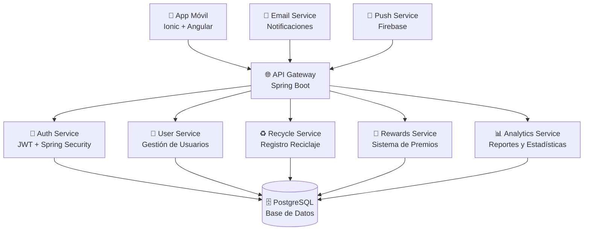

# 🌱 Eco Friendly Code - Sistema de Gestión Ambiental Universitario

> **Plataforma completa de gamificación ambiental para instituciones educativas**

[](https://angular.io/)
[](https://ionicframework.com/)
[](https://www.typescriptlang.org/)
[](https://capacitorjs.com/)
[](https://nodejs.org/)
[](LICENSE)

## 📋 Tabla de Contenidos

- [🎯 Visión General](#-visión-general)
- [✨ Características Principales](#-características-principales)
- [🏗️ Arquitectura del Sistema](#️-arquitectura-del-sistema)
- [🛠️ Stack Tecnológico](#️-stack-tecnológico)
- [📁 Estructura del Proyecto](#-estructura-del-proyecto)
- [🚀 Instalación y Configuración](#-instalación-y-configuración)
- [🔧 Configuración del Entorno](#-configuración-del-entorno)
- [📚 APIs y Endpoints Completos](#-apis-y-endpoints-completos)
- [🗄️ Modelos de Datos](#️-modelos-de-datos)
- [🔄 Servicios Frontend](#-servicios-frontend)
- [🎨 Desarrollo Frontend](#-desarrollo-frontend)
- [🧪 Testing y Calidad](#-testing-y-calidad)
- [🚀 Despliegue y Producción](#-despliegue-y-producción)
- [🤝 Contribución](#-contribución)
- [📄 Licencia](#-licencia)

---

## 🎯 Visión General

**Eco Friendly Code** es una aplicación móvil híbrida (iOS/Android/Web) desarrollada con Ionic + Angular que implementa un sistema completo de gamificación ambiental para estudiantes universitarios. La plataforma permite registrar actividades de reciclaje, acumular puntos, canjear recompensas ecológicas y visualizar el impacto ambiental institucional.

### 🎯 Objetivos Estratégicos

- **Gamificación Ambiental**: Convertir actividades ecológicas en experiencias engaging mediante puntos, niveles y recompensas
- **Monitoreo Institucional**: Seguimiento cuantitativo del impacto ambiental de toda la institución
- **Educación Continua**: Fomentar hábitos sostenibles a través de feedback inmediato y educación
- **Comunidad Verde**: Crear una red de estudiantes comprometidos con la sostenibilidad

### 👥 Roles de Usuario

| Rol | Permisos | Funcionalidades |
|-----|----------|-----------------|
| **Estudiante** | Básicos | Registro reciclaje, ver perfil, canjear premios, dashboard |
| **Profesor** | Moderación | Aprobar reciclajes, ver reportes, gestionar estudiantes |
| **Administrador** | Completos | Configuración sistema, gestión usuarios, reportes avanzados |

---

## ✨ Características Principales

### 🎮 Sistema de Gamificación
- **Puntos por Reciclaje**: Sistema automático de cálculo basado en material y peso
- **Niveles de Usuario**: Progresión basada en puntos acumulados
- **Recompensas Ecológicas**: Catálogo de premios sostenibles (árboles, productos eco)
- **Rankings**: Competencia saludable entre estudiantes e instituciones

### 📊 Dashboard Interactivo
- **Métricas en Tiempo Real**: Estadísticas personales e institucionales
- **Gráficos de Impacto**: Visualización de CO2 evitado, materiales reciclados
- **Actividad Reciente**: Historial de reciclajes con estados (aprobado/pendiente)
- **Comparativas**: Posición relativa en rankings institucionales

### ♻️ Gestión de Reciclaje
- **Registro Fotográfico**: Captura de evidencias de reciclaje
- **Validación por IA**: Detección automática de materiales (futuro)
- **Cálculo Automático**: Puntos basados en tipo de material y peso
- **Workflow de Aprobación**: Sistema de validación por coordinadores

### 👤 Gestión de Perfiles
- **Información Académica**: Carrera, semestre, institución
- **Historial Completo**: Todos los reciclajes y canjes realizados
- **Estadísticas Personales**: Impacto ambiental individual
- **Configuración Personalizada**: Notificaciones, tema, idioma

### 🔔 Sistema de Notificaciones
- **Push Notifications**: Alertas nativas en móvil
- **Recordatorios**: Prompts para registrar reciclaje
- **Anuncios**: Nuevas recompensas y eventos ambientales
- **Reportes Semanales**: Resumen de actividad semanal

---

## 🏗️ Arquitectura del Sistema

### Arquitectura General



### Arquitectura Frontend (Ionic/Angular)

```
src/
├── app/
│   ├── core/                      # Núcleo de la aplicación
│   │   ├── models/                # Interfaces TypeScript
│   │   │   ├── auth.model.ts      # Modelos de autenticación
│   │   │   ├── user.model.ts      # Modelos de usuario
│   │   │   ├── recycle.model.ts   # Modelos de reciclaje
│   │   │   ├── rewards.model.ts   # Modelos de recompensas
│   │   │   └── dashboard.model.ts # Modelos de dashboard
│   │   ├── services/              # Servicios HTTP
│   │   │   ├── auth.service.ts    # Autenticación
│   │   │   ├── user.service.ts    # Gestión usuario
│   │   │   ├── recycle.service.ts # Reciclaje
│   │   │   ├── rewards.service.ts # Premios
│   │   │   ├── dashboard.service.ts # Dashboard
│   │   │   ├── history.service.ts # Historial
│   │   │   └── notification.service.ts # Notificaciones
│   │   ├── guards/                # Guards de rutas
│   │   │   └── auth.guard.ts      # Protección rutas
│   │   └── interceptors/          # Interceptores HTTP
│   │       └── auth.interceptor.ts # JWT automático
│   ├── features/                  # Módulos por característica
│   │   ├── auth/                  # Autenticación
│   │   │   ├── login/             # Página login
│   │   │   └── register/          # Página registro
│   │   └── user-student-views/    # Vistas estudiante
│   │       ├── dashboard/         # Dashboard principal
│   │       ├── mi-perfil/         # Perfil usuario
│   │       ├── premios/           # Catálogo premios
│   │       ├── registrar-reciclaje/ # Registro reciclaje
│   │       ├── mi-historial/      # Historial actividades
│   │       └── configuracion/     # Configuración app
│   ├── shared/                    # Componentes compartidos
│   │   ├── components/            # Componentes reutilizables
│   │   ├── pipes/                 # Pipes personalizados
│   │   │   ├── number-format.pipe.ts
│   │   │   └── time-ago.pipe.ts
│   │   └── directives/            # Directivas
│   └── home/                      # Landing page
├── assets/                        # Recursos estáticos
│   ├── icons/                     # Iconos aplicación
│   └── images/                    # Imágenes materiales
├── environments/                  # Configuración por entorno
│   ├── environment.ts             # Desarrollo
│   └── environment.prod.ts        # Producción
└── theme/                         # Tema global
    └── variables.scss             # Variables SCSS
```

---

## 🛠️ Stack Tecnológico

### Frontend
| Tecnología | Versión | Propósito |
|------------|---------|-----------|
| **Angular** | 20.0.0 | Framework principal SPA |
| **Ionic** | 8.0.0 | UI Framework móvil |
| **TypeScript** | 5.4 | Lenguaje de programación |
| **Capacitor** | 8.3.1 | Runtime nativo móvil |
| **RxJS** | 7.8.0 | Programación reactiva |
| **SCSS** | Built-in | Estilos avanzados |

### Backend (Implementación Requerida)
| Tecnología | Versión | Propósito |
|------------|---------|-----------|
| **Spring Boot** | 3.2.x | Framework backend |
| **Java** | 21 LTS | Lenguaje JVM |
| **PostgreSQL** | 15.x | Base de datos |
| **JWT** | 0.11.x | Autenticación |
| **Spring Security** | 6.x | Seguridad |
| **JPA/Hibernate** | 6.x | ORM |
| **Flyway** | 9.x | Migraciones DB |

### DevOps & Herramientas
| Categoría | Herramientas |
|-----------|-------------|
| **Control de Versiones** | Git, GitHub |
| **CI/CD** | GitHub Actions |
| **Contenedorización** | Docker, Docker Compose |
| **Despliegue** | Vercel (Frontend), Railway (Backend) |
| **Testing** | Jasmine, Karma, JUnit |
| **Linting** | ESLint, Prettier |
| **Documentación** | Swagger/OpenAPI |

---

## 📁 Estructura del Proyecto

```
eco-friendly-code/
├── 📂 src/
│   ├── 📂 app/
│   │   ├── 📂 core/
│   │   │   ├── 📂 models/
│   │   │   │   ├── configuration.model.ts
│   │   │   │   ├── dashboard.model.ts
│   │   │   │   ├── history.model.ts
│   │   │   │   ├── recycle.model.ts
│   │   │   │   ├── rewards.model.ts
│   │   │   │   └── user.model.ts
│   │   │   └── 📂 services/
│   │   │       ├── auth.service.ts
│   │   │       ├── configuration.service.ts
│   │   │       ├── dashboard.service.ts
│   │   │       ├── history.service.ts
│   │   │       ├── notification.ts
│   │   │       ├── recycle.service.ts
│   │   │       ├── rewards.service.ts
│   │   │       └── user.service.ts
│   │   ├── 📂 features/
│   │   │   ├── 📂 Auth/
│   │   │   │   ├── 📂 login/
│   │   │   │   │   ├── login-routing.module.ts
│   │   │   │   │   ├── login.module.ts
│   │   │   │   │   ├── login.page.html
│   │   │   │   │   ├── login.page.scss
│   │   │   │   │   ├── login.page.spec.ts
│   │   │   │   │   └── login.page.ts
│   │   │   │   └── 📂 register/
│   │   │   │       ├── register-routing.module.ts
│   │   │   │       ├── register.module.ts
│   │   │   │       ├── register.page.html
│   │   │   │       ├── register.page.scss
│   │   │   │       ├── register.page.spec.ts
│   │   │   │       └── register.page.ts
│   │   │   └── 📂 UserStudentViews/
│   │   │       ├── 📂 configuracion/
│   │   │       ├── 📂 dashboard/
│   │   │       ├── 📂 mi-historial/
│   │   │       ├── 📂 mi-perfil/
│   │   │       ├── 📂 premios/
│   │   │       ├── 📂 registrar-reciclaje/
│   │   │       └── 📂 user-student-tabs/
│   │   ├── 📂 shared/
│   │   │   └── 📂 pipes/
│   │   │       ├── number-format.pipe.ts
│   │   │       └── time-ago.pipe.ts
│   │   └── 📂 home/
│   ├── 📂 assets/
│   │   ├── 📂 icon/
│   │   └── 📂 images/
│   ├── 📂 environments/
│   │   ├── environment.prod.ts
│   │   └── environment.ts
│   ├── 📂 theme/
│   │   └── variables.scss
│   ├── index.html
│   ├── main.ts
│   ├── polyfills.ts
│   ├── test.ts
│   └── zone-flags.ts
├── 📂 www/                          # Build output
├── angular.json                     # Config Angular CLI
├── capacitor.config.ts              # Config Capacitor
├── ionic.config.json                # Config Ionic
├── karma.conf.js                    # Config testing
├── package.json                     # Dependencias
├── tsconfig.json                    # Config TypeScript
├── tsconfig.app.json
├── tsconfig.spec.json
└── README.md                        # Este archivo
```

---

## 🚀 Instalación y Configuración

### Prerrequisitos

- **Node.js**: 18.x o superior
- **npm**: 9.x o superior (viene con Node.js)
- **Git**: Para control de versiones
- **Android Studio**: Para desarrollo Android (opcional)
- **Xcode**: Para desarrollo iOS (opcional, solo macOS)

### 1. Clonar el Repositorio

```bash
git clone https://github.com/tu-usuario/eco-friendly-code.git
cd eco-friendly-code
```

### 2. Instalar Dependencias

```bash
npm install
```

### 3. Configurar Variables de Entorno

Crear archivo `src/environments/environment.ts`:

```typescript
export const environment = {
  production: false,
  apiUrl: 'http://localhost:8080/api/v1',
  appName: 'Eco Friendly Code',
  version: '1.0.0'
};
```

### 4. Ejecutar en Desarrollo

```bash
# Servidor de desarrollo
npm start

# O usando Angular CLI
ng serve
```

La aplicación estará disponible en `http://localhost:4200`

### 5. Configurar Capacitor (Móvil)

```bash
# Agregar plataformas
npx cap add android
npx cap add ios

# Sincronizar cambios
npx cap sync

# Abrir en Android Studio
npx cap open android

# Abrir en Xcode
npx cap open ios
```

---

## 🔧 Configuración del Entorno

### Variables de Entorno

#### `src/environments/environment.ts` (Desarrollo)
```typescript
export const environment = {
  production: false,
  apiUrl: 'http://localhost:8080/api/v1',
  appName: 'Eco Friendly Code Dev',
  version: '1.0.0-dev',
  enableDebug: true,
  logLevel: 'debug'
};
```

#### `src/environments/environment.prod.ts` (Producción)
```typescript
export const environment = {
  production: true,
  apiUrl: 'https://api.ecofriendlycode.com/api/v1',
  appName: 'Eco Friendly Code',
  version: '1.0.0',
  enableDebug: false,
  logLevel: 'error'
};
```

### Configuración de Capacitor

#### `capacitor.config.ts`
```typescript
import { CapacitorConfig } from '@capacitor/cli';

const config: CapacitorConfig = {
  appId: 'com.ecofriendlycode.app',
  appName: 'Eco Friendly Code',
  webDir: 'www',
  server: {
    androidScheme: 'https'
  },
  plugins: {
    SplashScreen: {
      launchShowDuration: 3000,
      launchAutoHide: true
    }
  }
};

export default config;
```

### Configuración de Ionic

#### `ionic.config.json`
```json
{
  "name": "eco-friendly-code",
  "integrations": {
    "capacitor": {}
  },
  "type": "angular-standalone",
  "id": "com.ecofriendlycode.app"
}
```

---

## 📚 APIs y Endpoints Completos

La aplicación consume una API RESTful implementada en Spring Boot. Todos los endpoints requieren autenticación JWT excepto login y registro.

### 🔐 Autenticación (Auth Service)

#### `POST /api/v1/auth/login`
**Autenticar usuario**

**Request Body:**
```json
{
  "email": "estudiante@universidad.edu",
  "password": "password123"
}
```

**Response (200):**
```json
{
  "success": true,
  "timestamp": "2024-01-15T10:30:00Z",
  "data": {
    "token": "eyJhbGciOiJIUzI1NiIsInR5cCI6IkpXVCJ9...",
    "user": {
      "id": "user123",
      "email": "estudiante@universidad.edu",
      "nombre": "Juan",
      "apellido": "Pérez",
      "rol": "estudiante"
    }
  }
}
```

#### `POST /api/v1/auth/register`
**Registrar nuevo usuario**

**Request Body:**
```json
{
  "cedula": "1234567890",
  "nombre": "Juan",
  "apellido": "Pérez",
  "genero": "masculino",
  "email": "estudiante@universidad.edu",
  "carrera": "Ingeniería Ambiental",
  "password": "password123"
}
```

**Response (201):**
```json
{
  "success": true,
  "timestamp": "2024-01-15T10:30:00Z",
  "message": "Usuario registrado exitosamente"
}
```

### 👤 Usuario (User Service)

#### `GET /api/v1/users/profile`
**Obtener perfil del usuario autenticado**

**Headers:**
```
Authorization: Bearer {jwt_token}
```

**Response (200):**
```json
{
  "success": true,
  "data": {
    "id": "user123",
    "cedula": "1234567890",
    "nombre": "Juan",
    "apellido": "Pérez",
    "email": "estudiante@universidad.edu",
    "carrera": "Ingeniería Ambiental",
    "genero": "masculino",
    "institution": "Universidad Nacional",
    "registrationDate": "2024-01-01T00:00:00Z",
    "userLevel": 5,
    "totalReciclajes": 25,
    "premiosCanjeados": 3,
    "totalPoints": 1250,
    "materialReciclado": 45.5,
    "co2Evitado": 12.3,
    "institutionRank": 15,
    "totalInstitutionUsers": 500
  }
}
```

#### `PUT /api/v1/users/profile`
**Actualizar perfil del usuario**

**Request Body:**
```json
{
  "nombre": "Juan Carlos",
  "carrera": "Ingeniería Civil"
}
```

#### `GET /api/v1/users/history`
**Obtener historial de actividades**

**Response (200):**
```json
{
  "success": true,
  "data": [
    {
      "id": "hist123",
      "type": "reciclaje",
      "title": "Reciclaje de Plástico",
      "status": "aprobado",
      "date": "2024-01-15T08:30:00Z",
      "details": ["Botellas PET: 2kg", "Envases: 1kg"],
      "note": "Reciclaje aprobado por coordinador",
      "points": 150
    }
  ]
}
```

#### `GET /api/v1/users/settings`
**Obtener configuración del usuario**

#### `PUT /api/v1/users/settings`
**Actualizar configuración**

**Request Body:**
```json
{
  "notifications": {
    "reciclajeAprobado": true,
    "nuevosPremios": true,
    "reporteSemanal": false,
    "actualizacionesSistema": true
  },
  "theme": "dark",
  "language": "es"
}
```

#### `PUT /api/v1/users/change-password`
**Cambiar contraseña**

**Request Body:**
```json
{
  "currentPassword": "oldpass123",
  "newPassword": "newpass456"
}
```

#### `DELETE /api/v1/users/account`
**Eliminar cuenta**

### ♻️ Reciclaje (Recycle Service)

#### `GET /api/v1/recycle/materials`
**Obtener materiales disponibles**

**Response (200):**
```json
{
  "success": true,
  "dat
